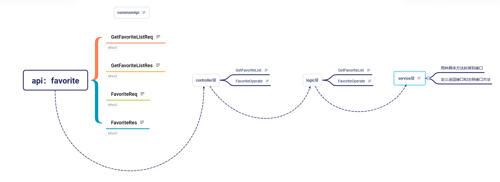

# Maas代码阅读记录

## 代码结构

根据其中一条API，走了一个路径。具体如下



## 依赖注入

> [!NOTE]
>
> 目前个人理解就是单独封装方法和接口，然后通过接口或者结构体字段等方式调用。而不是直接在内部实现

```go
package main

import "fmt"

// 日志记录器接口
type Logger interface {
    Log(message string)
}

// 具体的日志记录器结构体
type ConsoleLogger struct{}

func (cl *ConsoleLogger) Log(message string) {
    fmt.Println("Logging to console:", message)
}

// 订单服务结构体
type OrderService struct {
    logger Logger
}

// 构造函数，通过参数注入依赖
func NewOrderService(logger Logger) *OrderService {
    return &OrderService{
        logger: logger,
    }
}

// 处理订单的方法
func (os *OrderService) ProcessOrder() {
    os.logger.Log("Processing an order...")
}

func main() {
    // 创建日志记录器实例
    logger := &ConsoleLogger{}
    // 创建订单服务实例，并注入日志记录器依赖
    orderService := NewOrderService(logger)
    orderService.ProcessOrder()
}
```

> 在这个改进后的例子中，`NewOrderService` 构造函数接收一个 `Logger` 接口类型的参数，由外部创建 `Logger` 实例并传递给 `OrderService`，这就是依赖注入。这样做的好处是，如果以后要换一个日志记录器，只需要创建一个新的实现了 `Logger` 接口的结构体，然后在创建 `OrderService` 实例时传入新的日志记录器实例，而不需要修改 `OrderService` 的代码。

代码中的service层中使用了依赖注入的思想