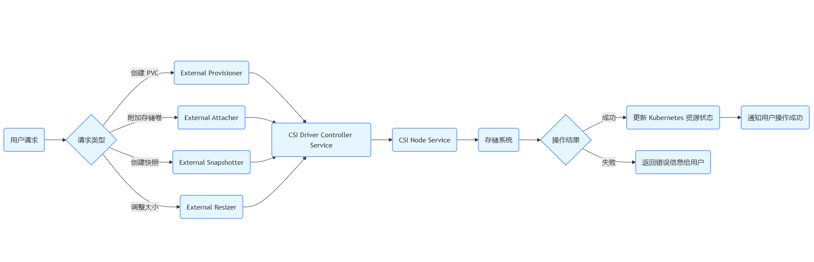

# CSI组件

### 流程图说明

1. **用户请求**：用户通过 Kubernetes API 提交创建 PVC、附加存储卷、创建快照或调整大小等请求。
2. **请求分类**：根据请求类型，将请求转发给相应的外部组件（External Provisioner、External Attacher、External Snapshotter 或 External Resizer）。
3. **调用 CSI Driver**：外部组件通过 gRPC 协议调用 CSI Driver 的 Controller Service 来处理请求。
4. **节点操作**：Controller Service 可能会调用 CSI Node Service 在节点上执行具体的操作，如挂载存储卷。
5. **存储系统交互**：CSI Node Service 与底层的存储系统进行交互，完成实际的存储操作。
6. **结果处理**：根据操作结果，更新 Kubernetes 资源状态，并将结果通知给用户。

### CSI 设计结构

#### 1. 主要组件

- 

  CSI Driver

  ：这是存储供应商提供的插件，实现了 CSI 规范定义的接口。它负责与具体的存储系统进行交互，完成存储卷的创建、删除、挂载、卸载等操作。CSI Driver 通常包含三个主要的服务：

  - **Controller Service**：处理存储卷的创建、删除、快照等集群级别的操作。
  - **Node Service**：处理存储卷在节点上的挂载、卸载等操作。
  - **Identity Service**：提供插件的基本信息，如名称、版本等。

- **CSI Plugin Registry**：用于存储系统中注册和发现 CSI Driver 的组件。Kubernetes 中的 `csi-driver-registrar` 就是一个典型的插件注册器，它会在节点上运行的 CSI Driver 启动时，将其信息注册到 Kubernetes API Server 中。

- **External Provisioner**：这是一个外部组件，负责调用 CSI Driver 的 Controller Service 来创建和管理持久卷（Persistent Volume，PV）。当用户在 Kubernetes 中创建一个 PersistentVolumeClaim（PVC）时，External Provisioner 会根据 PVC 的请求调用 CSI Driver 来动态创建 PV。

- **External Attacher**：用于调用 CSI Driver 的 Controller Service 来将存储卷附加到节点上。当一个 PV 被绑定到一个 PVC 后，External Attacher 会确保该存储卷被正确地附加到使用该 PVC 的 Pod 所在的节点上。

- **External Snapshotter**：调用 CSI Driver 的 Controller Service 来创建存储卷的快照。用户可以通过创建一个 VolumeSnapshot 对象来触发 External Snapshotter 调用 CSI Driver 生成存储卷的快照。

- **External Resizer**：允许用户动态调整持久卷的大小。当用户修改 PersistentVolumeClaim 的存储大小请求时，External Resizer 会调用 CSI Driver 的 Controller Service 来调整底层存储卷的大小。

#### 2. 通信流程

- **节点上的通信**：kubelet（Kubernetes 节点代理）通过 gRPC 协议与节点上运行的 CSI Node Service 进行通信，以完成存储卷的挂载、卸载等操作。
- **控制平面与 CSI Driver 的通信**：External Provisioner、External Attacher、External Snapshotter 和 External Resizer 等外部组件通过 gRPC 协议与 CSI Driver 的 Controller Service 进行通信，以完成存储卷的创建、删除、附加、分离、快照和调整大小等操作。